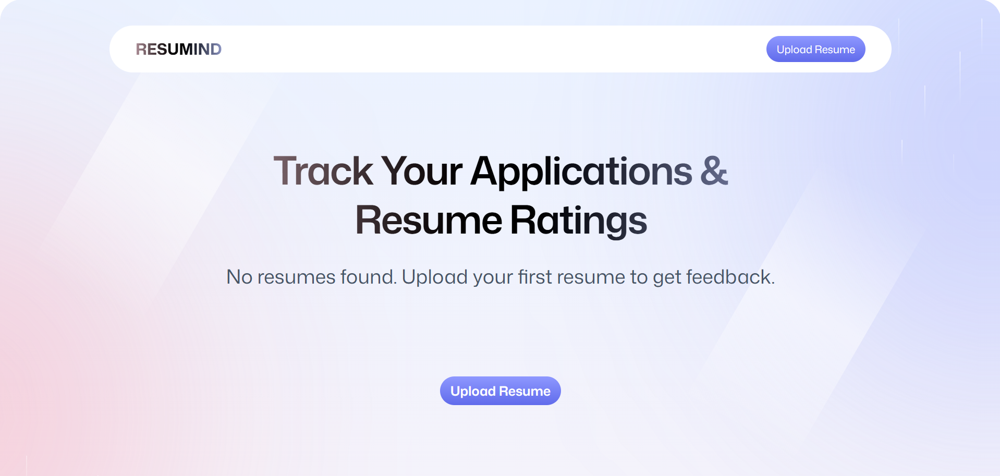

🚀 **Project Title & Tagline**
-------------------------

**Project Title:** Ai_Resume_Builder
**Tagline:** A React-based application for tracking your Applications & resume ratings.

** ▶️▶️▶️ [Live Demo](https://vite-project-eta-eight.vercel.app/)**

📖 **Description**
----------------
Ai_Resume_Builder is a React + TypeScript application that helps users optimize their resumes with AI-powered insights. The app is built using Vite for a fast development experience, React (with TypeScript) for type-safe and scalable UI, and Puter.js for seamless file handling and storage.

With Ai_Resume_Builder, users can upload their resumes and instantly see:

ATS (Applicant Tracking System) Score – showing how well the resume aligns with a given job description (JD).

Detailed Ratings & Feedback – highlighting strengths, weaknesses, and areas for improvement.

Job Description Matching – insights into keywords and requirements missing from the resume.

✨ **Features**
----------------

* Resume Upload & Management with Puter.js integration.

* AI-Powered Analysis of resumes against any JD.

* Instant Feedback & Suggestions to improve hiring chances.

* Interactive Dashboard for clear, actionable results.

* Built with TypeScript for scalability and maintainability.

🧰 **Tech Stack**
-----------------

### Frontend

* React: A JavaScript library for building user interfaces
* Vite: A modern web development tool for building fast and efficient web applications
* Tailwind CSS: A utility-first CSS framework for styling web applications
* React Router: A client-side routing library for building web applications

### Tools

* PDF.js: A JavaScript library for generating and manipulating PDF files
* Zustand: A state management library for building web applications
* clsx: A utility library for styling web applications

📁 **Project Structure**
------------------------

The project structure is as follows:

* `src`: The source code for the application
    + `components`: React components for the application
    + `containers`: Higher-order components for the application
    + `utils`: Utility functions for the application
    + `styles`: CSS styles for the application
* `public`: Static files for the application
    + `index.html`: The main HTML file for the application
* `package.json`: The project configuration file
* `README.md`: This file!

⚙️ **How to Run**
-----------------

### Setup

1. Clone the repository: `git clone https://github.com/your-username/vite-react-pdf-resume.git`
2. Install the dependencies: `npm install`
3. Start the development server: `npm run dev`
4. Open the application in a web browser: `http://localhost:3000`

### Environment

The application uses the following environment variables:

* `VITE_API_URL`: The URL for the API
* `VITE_MONGO_URI`: The URI for the MongoDB database

### Build

The application can be built by running the following command: `npm run build`

### Deploy

The application can be deployed by running the following command: `npm run deploy`

🧪 **Testing Instructions**
-------------------------

The application uses Jest and Enzyme for testing. To run the tests, follow these steps:

1. Install the dependencies: `npm install`
2. Run the tests: `npm test`

📸 **Screenshots**
-----------------

Here are some screenshots of the application:

📦 **API Reference**
------------------

The application uses the following API endpoints:

* `GET /api/resumes`: Retrieves a list of resumes
* `GET /api/resumes/:id`: Retrieves a single resume by ID
* `POST /api/resumes`: Creates a new resume
* `PUT /api/resumes/:id`: Updates a single resume by ID
* `DELETE /api/resumes/:id`: Deletes a single resume by ID

👤 **Author**
-------------

This project was created by [Tushar Mishra](https://github.com/tm33976/Ai_Resume_Builder).

📝 **License**
-------------

This project is licensed under the MIT License. See the [LICENSE](LICENSE) file for more information.

I hope this README.md file meets your requirements! Let me know if you have any further requests. 😊